# Getaway

GetAway is a project developed for the Web Development course. This web application enables users to create personalized trips with features such as recommendations, to-do lists, maps, and weather forecasts. The project aims to expand its capabilities to include booking accommodations and selecting transportation options for the trip (in the future).

# Workflow

Project tasks and progress are tracked in the **Issues** section.

Additionally, a GitHub Actions workflow is included to automatically check **Python code formatting** using **Black**.

# React + Vite

React is working in Vite with HMR and some ESLint rules.

With two official plugins are available:

- [@vitejs/plugin-react](https://github.com/vitejs/vite-plugin-react/blob/main/packages/plugin-react/README.md) uses [Babel](https://babeljs.io/) for Fast Refresh
- [@vitejs/plugin-react-swc](https://github.com/vitejs/vite-plugin-react-swc) uses [SWC](https://swc.rs/) for Fast Refresh

# Dependencies and run

This project relies on a **Google API key**. You must create a `.env` file in the root directory with the following environment variable:

```bash
VITE_REACT_APP_GOOGLE_API=your_api_key_here
```

1. **Create a Vite Project**

    If not already set up:

    ```bash
    npm create vite@latest
    ```

2. **Install Dependencies**

    If using a requirements.txt for Python packages:

    ```bash
    pip install -r requirements.txt
    ```

    Install frontend dependencies

    ```bash
    npm init -y
    npm install
    ```

3. **Set Up MongoDB**

    Start MongoDB with Docker and initiate the replica set:

    ```bash
    docker exec -it mongo1 mongosh
    ```

    Inside the Mongo shell:

    ```bash
    rs.initiate({
    _id: "rs0",
    members: [
        { _id: 0, host: "mongo1:27017" },
        { _id: 1, host: "mongo2:27017" },
        { _id: 2, host: "mongo3:27017" }
    ]
    });
    ```

4. **Run the Project**

    - Start the website:

            ```bash
            npm run dev
            ```

    - Start the services

            ```bash
            docker compose up --build
            ```

## Additional Packages  

- Date Picker
        ```bash
        npm install --save react-date-range
        npm install --save react date-fns
        ```

- Swiper (Carousel)

        ```bash
        npm install swiper
        ```

- Google Maps JavaScript API Wrapper for React

        ```bash
        npm install @googlemaps/react-wrapper
        ```

# Microservices Architecture

The microservices are located in the folder `src/services`.

The core of this project is built around a microservices architecture, each responsible for a specific domain of the application:

- **User Service** – Handles user authentication, registration, and profile management. Uses **SQLite** for lightweight, persistent storage.
- **API Facade Service** – Acts as the main gateway for the frontend, orchestrating calls to various backend services and simplifying client interaction.
- **Journeys Service** – Manages travel plans, destinations, and trip-related data. Backed by **MongoDB** for flexible document storage, with communication handled through a **message queue** (Redis).
- **Weather Service** – Fetches and delivers weather forecasts for selected destinations.
- **Coords Service** – Handles geolocation processing.
- **Google Places Service** – Integrates with the **Google Places API** to provide information about nearest destination places.

<p align="center">
    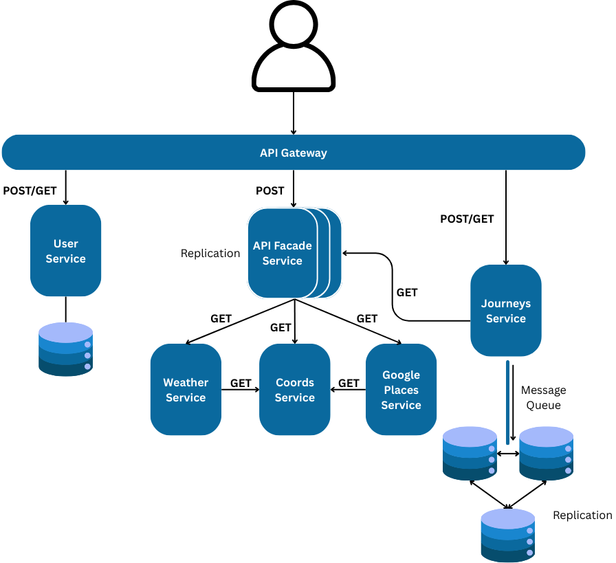
</p>

# Scenario

Upon landing on the main page, the user is prompted to either log in or sign up to access the trip planning features.

<p align="center">
    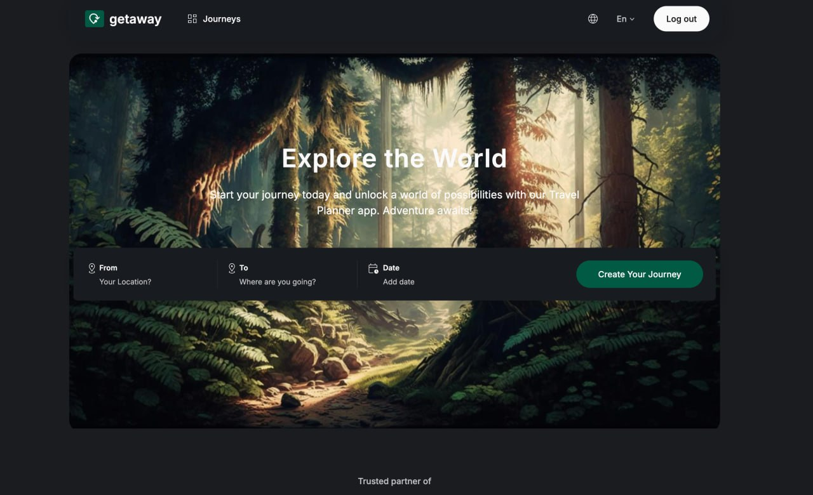
</p>

<p align="center">
    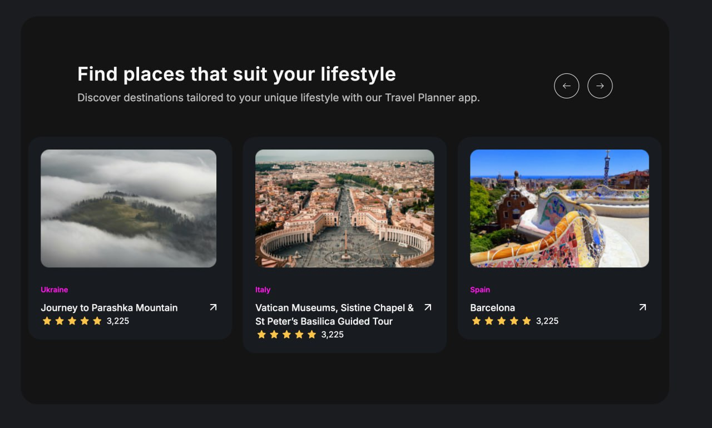
</p>

1. **User Registration & Authentication**

    When a new user signs up, their credentials and profile data are stored in the User Service, which uses a lightweight SQLite database for persistent storage.
    Returning users can log in to access their personal trip data.
    
    <p align="center">
        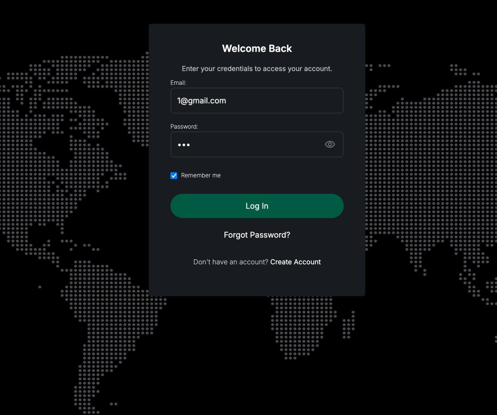
    </p>
    
    <p align="center">
        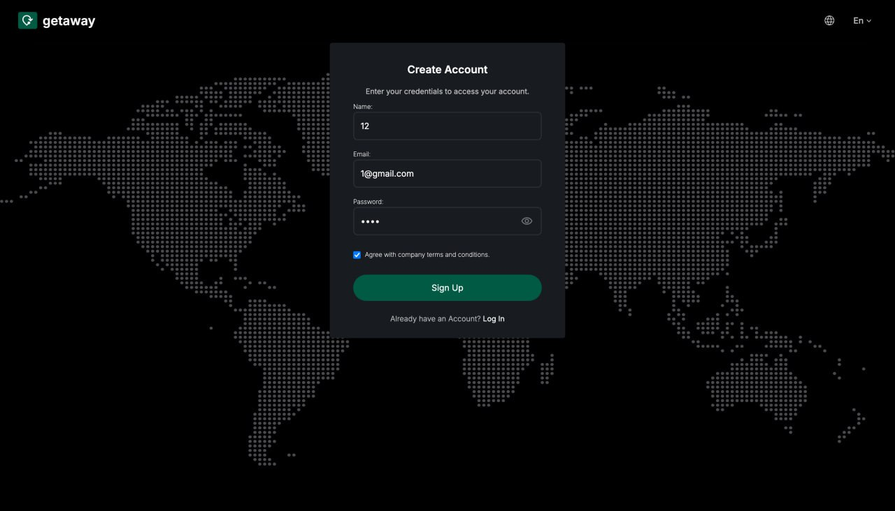
    </p>

3. **Creating a Journey**

    After logging in, users are redirected to the main dashboard where they can create a new trip by selecting the source, destination, and travel dates.

    <p align="center">
        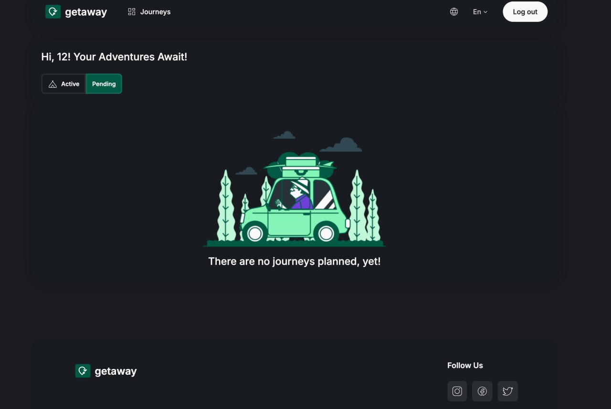
    </p>

    Once the user submits the trip details, they are redirected to the trip creation/edit page. This stage triggers coordination between several backend services via the API Facade Service, which orchestrates calls to:

    - Coords Service – for retrieving geolocation data of source and destination.

    - Weather Service – for weather forecasts at the chosen destination and date.

    - Google Places Service – for nearby points of interest based on the selected location.
    
    <p align="center">
        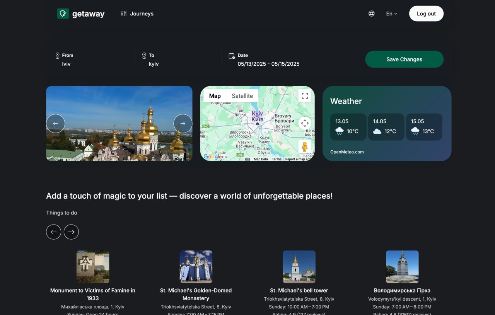
    </p>

5. **Enriching the Journey**

    Users can add further information to their trip:

    - Description and To-Do List – saved as part of the journey data.

    - Friends – selected from the user’s contact list (fetched from the User Service) and added as travel companions.

    All trip-specific data, including the itinerary, description, and associated users, is stored in the Journeys Service, which utilizes MongoDB for flexible document storage. The service also communicates with a Redis queue for asynchronous processing tasks.

    
    <p align="center">
        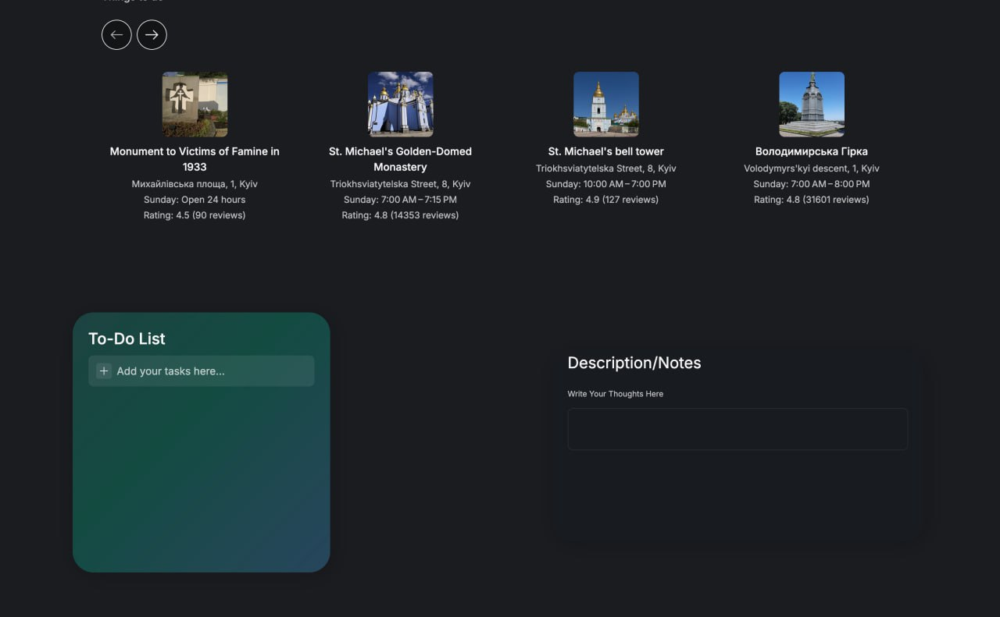
    </p>
    
    <p align="center">
        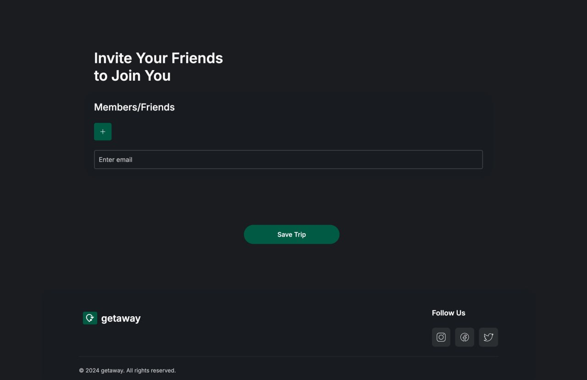
    </p>

6. **Viewing Journeys**

    Users can view a list of all their journeys—both active and pending—on the journeys dashboard.

    <p align="center">
        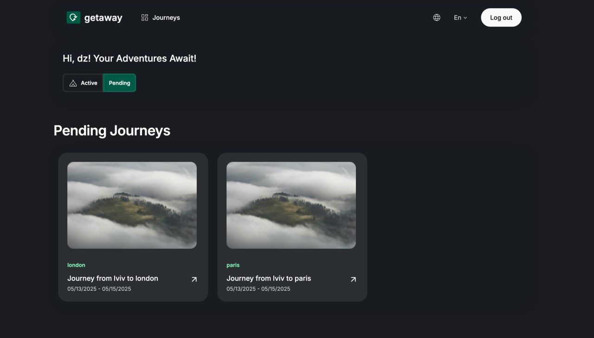
    </p>

    By clicking on a journey, the user opens a journey widget displaying trip details. At this point, fresh dynamic data is retrieved again via the API Facade from the relevant services (Coords, Weather, Places). This data is not stored in the database to ensure it remains current and up to date.

    <p align="center">
        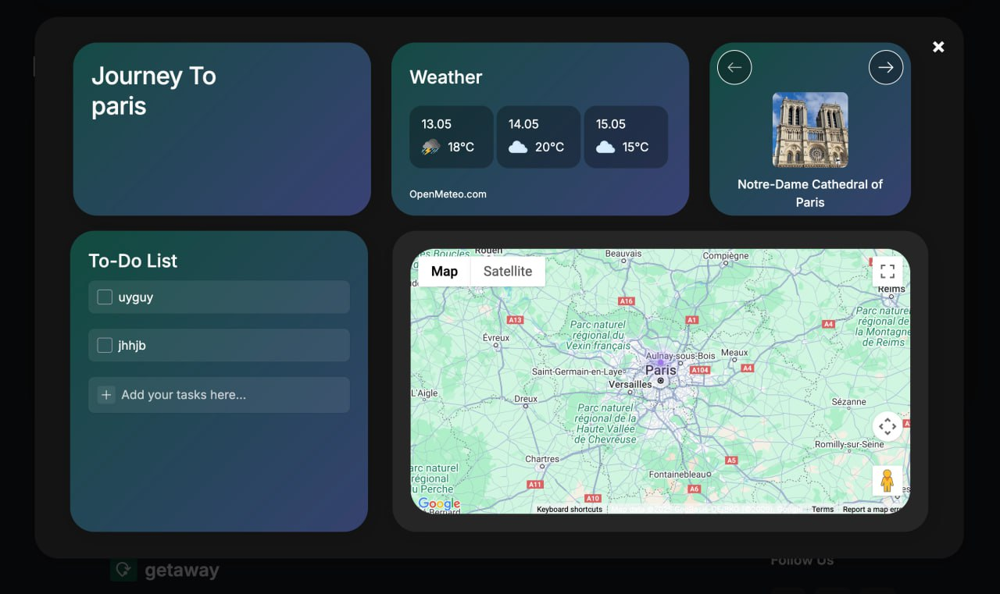
    </p>
    
    <p align="center">
        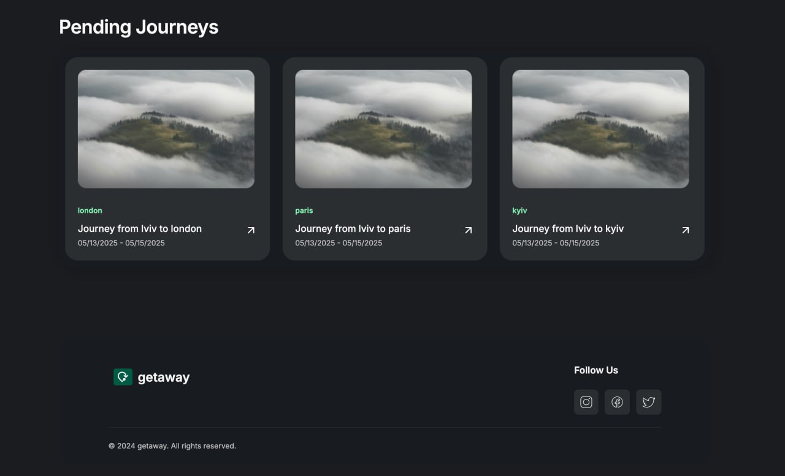
    </p>
